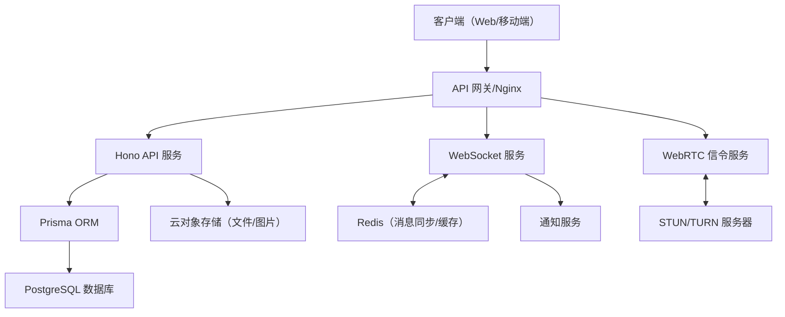

# 系统架构文档（Architecture Doc）

## 一、架构目标

- 支持高并发、低延迟的实时文字与语音聊天
- 易于扩展、维护和部署
- 保证数据安全与系统高可用

---

## 二、整体架构图

---

## 三、核心组件说明

### 1. 客户端（Web/移动端）
- 使用 React/Vue + TailwindCSS
- 通过 REST API 进行业务操作
- 通过 WebSocket 实现文字消息实时通信
- 通过 WebRTC 实现语音通话

### 2. API 网关/Nginx
- 统一入口，负责路由转发、负载均衡、限流和安全防护

### 3. Hono API 服务（Node.js）
- 负责用户、房间、权限、文件等业务逻辑
- 路由采用 Hono 框架，接口风格 RESTful
- 通过 Prisma 连接 PostgreSQL 数据库
- 文件上传接口对接云对象存储

### 4. WebSocket 服务
- 负责文字消息的实时收发、广播
- 支持多节点部署，使用 Redis Pub/Sub 实现消息同步
- 负责房间成员在线状态、@提醒、消息撤回等事件推送

### 5. WebRTC 信令服务
- 负责语音通话的信令交换（offer/answer/candidate）
- 协助建立点对点语音通道
- 依赖 STUN/TURN 服务器实现 NAT 穿透和中继

### 6. Prisma ORM
- 作为 Node.js 与 PostgreSQL 的数据访问层
- 负责数据建模、查询、事务、迁移等

### 7. PostgreSQL 数据库
- 存储用户、房间、消息、权限等核心数据
- 支持主从复制、读写分离，保障高并发和数据安全

### 8. Redis
- 用于缓存热点数据、会话管理
- 实现 WebSocket 多节点间的消息同步（Pub/Sub）

### 9. 云对象存储
- 聊天图片、文件等静态资源存储
- 生成可访问链接供前端展示

### 10. STUN/TURN 服务器
- 提供 WebRTC 语音通信的网络穿透和中继能力（如 coturn）

### 11. 通知服务
- 推送新消息、@提醒、系统公告等

---

## 四、部署与高可用设计

- API 服务、WebSocket 服务、信令服务均可多实例部署，支持容器化（Docker/K8s）
- Nginx/API 网关实现负载均衡
- PostgreSQL 主从复制，读写分离
- Redis 集群部署，保障高可用
- 日志、监控、自动告警系统（如 ELK、Prometheus + Grafana）

---

## 五、数据流与业务流程

1. **用户登录/注册**  
   客户端 → Hono API（鉴权、用户信息）→ PostgreSQL

2. **房间管理**  
   客户端 → Hono API（房间创建/加入/退出/成员管理）→ PostgreSQL

3. **文字聊天**  
   客户端 ↔ WebSocket 服务（消息实时收发）↔ Redis（多节点同步）↔ PostgreSQL（消息持久化）

4. **语音聊天**  
   客户端 ↔ WebRTC 信令服务（信令交换）↔ STUN/TURN 服务器（网络穿透）  
   语音数据点对点传输，必要时通过 TURN 中继

5. **文件上传**  
   客户端 → Hono API（上传接口）→ 云对象存储  
   文件URL存入数据库，供消息引用

---

## 六、安全与合规

- 所有接口和 WebSocket 事件均需 JWT 鉴权
- 敏感操作需校验用户角色
- 聊天内容敏感词过滤
- 文件上传类型、大小校验
- 日志记录与异常告警

---

如需进一步细化到具体服务部署方案、接口文档、数据库ER图、消息同步机制等，请随时告知！